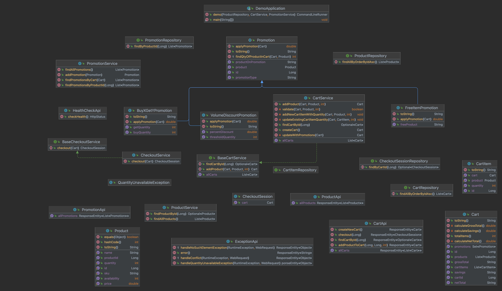
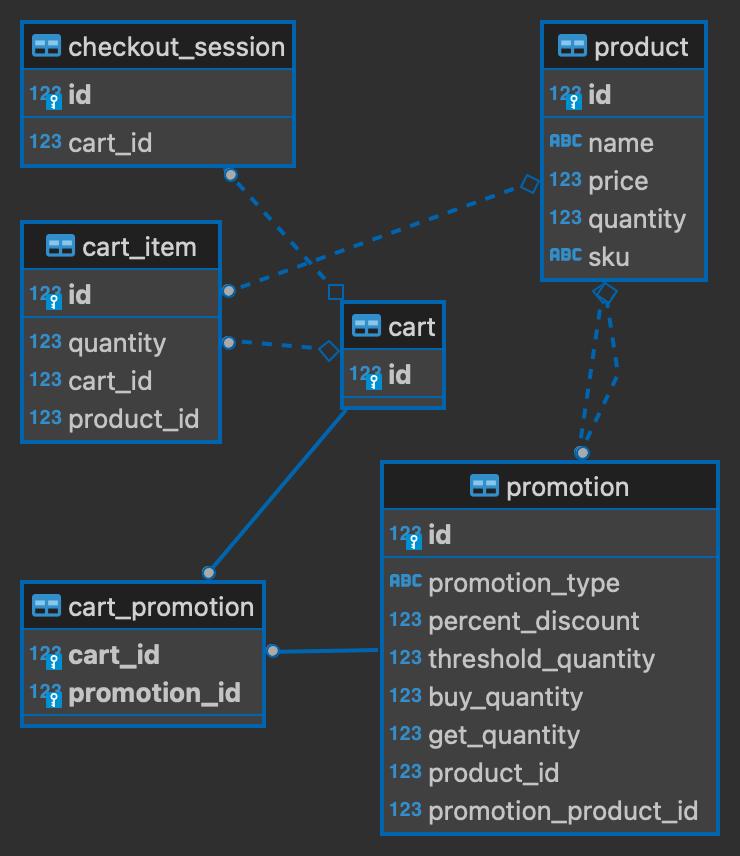

# BCG Coding Challenge - Backend

## Usage 

This project uses Docker Compose to build and run the PostgreSQL
database, PGAdmin, and the Spring Boot Cart REST API. 

###### Build and run this project

Run the following command:

```
make up
```

or 

```
docker-compose up --build
```

###### Once all docker containers are up and running

1. Interactive Swagger UI Docs for the Back-end are available at: http://localhost:8080/
2. PGAdmin is available at: http://localhost:5050
  
- The below credentials (from `.env` file) can be used to access PGAdmin and PostgreSQL:

  ```
  POSTGRES_USER=root
  POSTGRES_PASSWORD=password
  PGADMIN_DEFAULT_EMAIL=root@root.com
  PGADMIN_DEFAULT_PASSWORD=password
   ```

3. Optionally, the PostgreSQL DB port is directly exposed at: http://localhost:5432

###### Using the Cart API 

Swagger Interactive Docs: http://localhost:8080/ 

#### Products

Product IDs for each product have been seeded as below:

| id 	| name           	| price   	| quantity 	| sku    	|
|----	|----------------	|---------	|----------	|--------	|
| 1  	| Google Home    	| 49.99   	| 10       	| 120P90 	|
| 2  	| MacBook Pro    	| 5399.99 	| 5        	| 43N23P 	|
| 3  	| Alexa Speaker  	| 109.5   	| 10       	| A304SD 	|
| 4  	| Raspberry Pi B 	| 30.0    	| 2        	| 234234 	|


1. Start by creating a new, empty cart:

```
POST http://localhost:8080/cart/new
```

2. Using the cartId from the response, add 1 Alexa speaker to the cart.

```
POST http://localhost:8080/cart/{cartId}/{productId}/{quantity}
i.e,
POST http://localhost:8080/cart/6/3/1
```

2. POST the same request 2 more times, so that there are 3 Alexa speakers in the cart. 
The 10% promotion should now be applied with a response as below:

```
{
    "cartId": 6,
    "cartItems": [
        {
            "product": {
                "sku": "A304SD",
                "name": "Alexa Speaker",
                "price": 109.5,
                "productId": 3,
                "availability": 10
            },
            "quantity": 3
        }
    ],
    "promotions": [
        {
            "promotionType": "VolumeDiscountPromotion",
            "thresholdQuantity": 3,
            "percentDiscount": 0.1,
            "productOnPromotion": "Alexa Speaker"
        }
    ],
    "grossTotal": "328.50",
    "savings": "32.85",
    "netTotal": "295.65"
}
```

3. Remove the Alexa speakers from the cart. By sending 3 consecutive delete requests as below, 
or, by changing the quantity (right-most path variable) to 3. 

``` 
DELETE http://localhost:8080/cart/6/3/1
``` 

4. Then, add 1 Macbook to the cart. 

``` 
http://localhost:8080/cart/6/2/1
```

- Sample response: 

``` 
{
    "cartId": 6,
    "cartItems": [
        {
            "product": {
                "sku": "43N23P",
                "name": "MacBook Pro",
                "price": 5399.99,
                "productId": 2,
                "availability": 5
            },
            "quantity": 1
        }
    ],
    "promotions": [
        {
            "promotionType": "FreeItemPromotion",
            "freeProduct": "Raspberry Pi B",
            "productOnPromotion": "MacBook Pro"
        }
    ],
    "grossTotal": "5399.99",
    "savings": "0.00",
    "netTotal": "5399.99"
}
```

5. Then, add 1 Raspberry Pi to the cart

``` 
http://localhost:8080/cart/6/4/1
```

6. The promotion should be applied and the Raspberry Pi should is free

- Sample response 

``` 
{
    "cartId": 6,
    "cartItems": [
        {
            "product": {
                "sku": "43N23P",
                "name": "MacBook Pro",
                "price": 5399.99,
                "productId": 2,
                "availability": 5
            },
            "quantity": 1
        },
        {
            "product": {
                "sku": "234234",
                "name": "Raspberry Pi B",
                "price": 30,
                "productId": 4,
                "availability": 2
            },
            "quantity": 1
        }
    ],
    "promotions": [
        {
            "promotionType": "FreeItemPromotion",
            "freeProduct": "Raspberry Pi B",
            "productOnPromotion": "MacBook Pro"
        }
    ],
    "grossTotal": "5429.99",
    "savings": "30.00",
    "netTotal": "5399.99"
}
```

7. Now, again create a new cart or remove products from the cart. 

``` 
POST http://localhost:8080/cart/new
```

8. Then, add 3 Google homes to the cart. The corresponding promotion is applied.

``` 
POST http://localhost:8080/cart/11/1/3
```

- Sample response 

``` 
{
    "cartId": 11,
    "cartItems": [
        {
            "product": {
                "sku": "120P90",
                "name": "Google Home",
                "price": 49.99,
                "productId": 1,
                "availability": 10
            },
            "quantity": 3
        }
    ],
    "promotions": [
        {
            "promotionType": "BuyXGetYPromotion",
            "buyQuantity": 2,
            "getQuantity": 3,
            "productOnPromotion": "Google Home"
        }
    ],
    "grossTotal": "149.97",
    "savings": "49.99",
    "netTotal": "99.98"
}
``` 

## Description

On start-up, the Spring Boot Cart API seeds the database with the 
provided Products and Promotions information. 

#### Promotions

- *Each sale of a MacBook Pro comes with a free Raspberry Pi B*
- *Buy 3 Google Homes for the price of 2*
- *Buying more than 3 Alexa Speakers will have a 10% discount on all Alexa speakers*

Using Hibernate ORM [Single Table Inheritance strategy](https://www.baeldung.com/hibernate-inheritance#single-table):

| promotion_type          	| id 	 | promotion_quantity 	| required_quantity 	| percent_discount 	| threshold_quantity 	| product_id 	| promotion_product_id 	|
|-------------------------	|------|--------------------	|-------------------	|------------------	|--------------------	|------------	|----------------------	|
| VolumeDiscountPromotion 	| 1  	 |                    	|                   	| 0.1              	| 3                  	| 3          	|                      	|
| FreeItemPromotion       	| 2  	 |                    	|                   	|                  	|                    	| 2          	| 4                    	|
| MultiBuyPromotion       	| 3  	 | 3                  	| 2                 	|                  	|                    	| 1          	|                      	|

# Project Overview 

## Class Diagram 



## Data Model 



## Java 17 
Java is a widely used object-oriented programming language for back-end development. 
Like Go, it is a statically-typed, multi-paradigm and compiled language.
With a large range of support and libraries, the use of OOP and 
SOLID design principles can be readily applied. 

## Maven 3.8.6
Maven is a project lifecycle management and build tool, with similarities to 
`npm` for NodeJS or `poetry` for Python. The `maven` docker image 
is used during the Docker multi-stage build to compile, test and package 
the application before it is deployed to a JDK17 Docker image at run-time. 

## Spring Boot 2.7.3 

Java Spring Framework is a popular and open-source framework for creating
production-ready Java applications. Spring Boot further builds upon 
Spring Framework by taking an opinionated view of the Spring platform
to minimise the amount of manual configuration required.

Spring Boot comes with starter dependency bundles, such as `spring-boot-starter-web`, 
`spring-boot-starter-data-jpa`, and `spring-boot-starter-data-test`, which were used 
in this project in order to quickly get up and
running without worrying about dependency management.

## Hibernate ORM 

Hibernate is a well-known, high-performance, scalable and reliable
Object/Relational Mapping framework used with Java JDBC and JPA. It enables
the persistence of complex data relationships, such as *OneToMany*, *ManyToOne* 
and *ManyToMany* relationships, with no direct SQL required. 

## PostgreSQL 

A PostgreSQL database hosted within the docker compose network with a hostname of `database`. 
PGAdmin console is available at http://localhost:5050.

## Docker

Docker and Docker Compose are used to orchestrate the build and deployment 
of the Spring Boot Cart API, the PostgreSQL DB and the PGAdmin interface, 
as well as incorporate health-checking with auto-restart. 

A multi-stage Docker build is used for the Spring Boot Cart API, 
so that the size of the final Docker container is minimised. 

## Exception Handling 
API Exceptions are handled centrally through an `ExceptionApi` *@RestController*, 
with a fall-back default  error response of *400 Bad Request*.

## Testing

Junit5 is a testing library that comes bundled with Spring Boot 2.7.3. 
Unit testing, integration testing and e2e test cases are partially 
covered. 

*@SpringBootTest* is used for e2e testing of the Cart API. It starts the API 
on a random port and sends HTTP GET/POST/PUT requests. 

Integration testing relies on seeded data in `src/test/java/resources/import.sql` and 
`DemoApplication.java`. 

A separate, in-memory database is spun up for testing.  

## Assumptions 

- Items must already exist in cart for a Promotion to be applied.  
